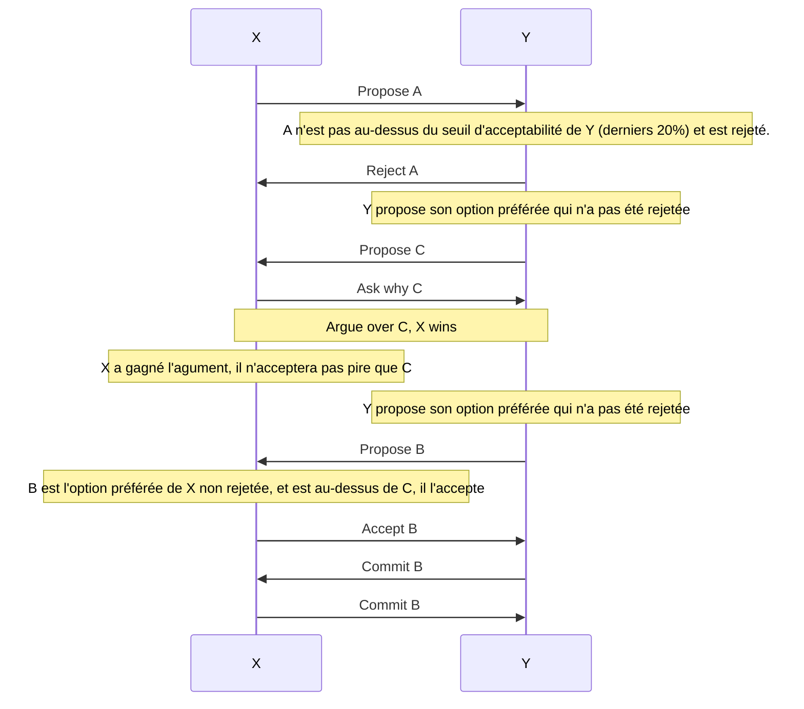
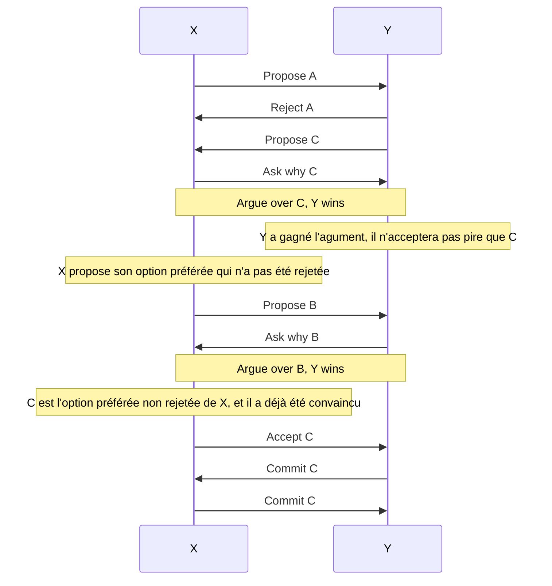
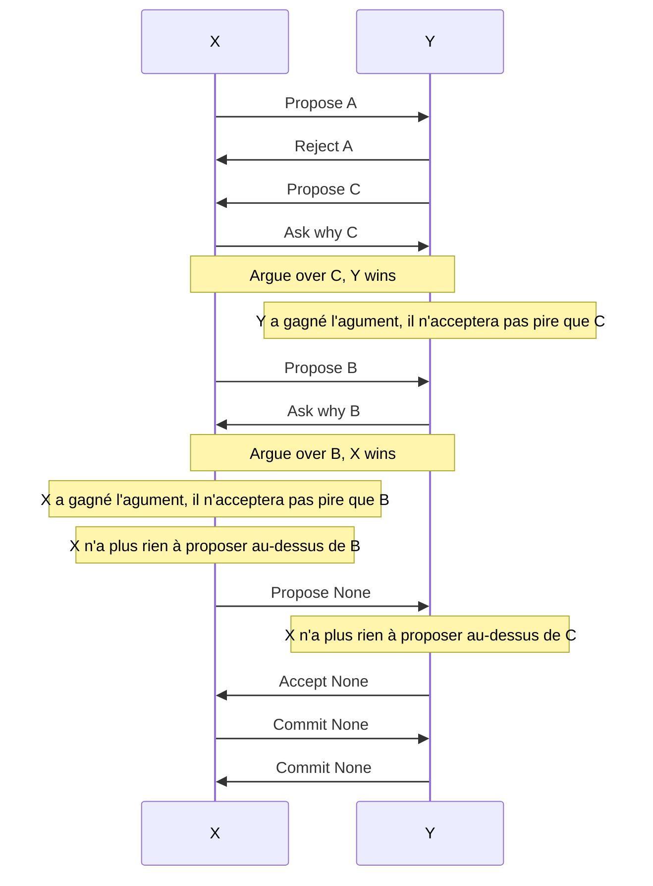
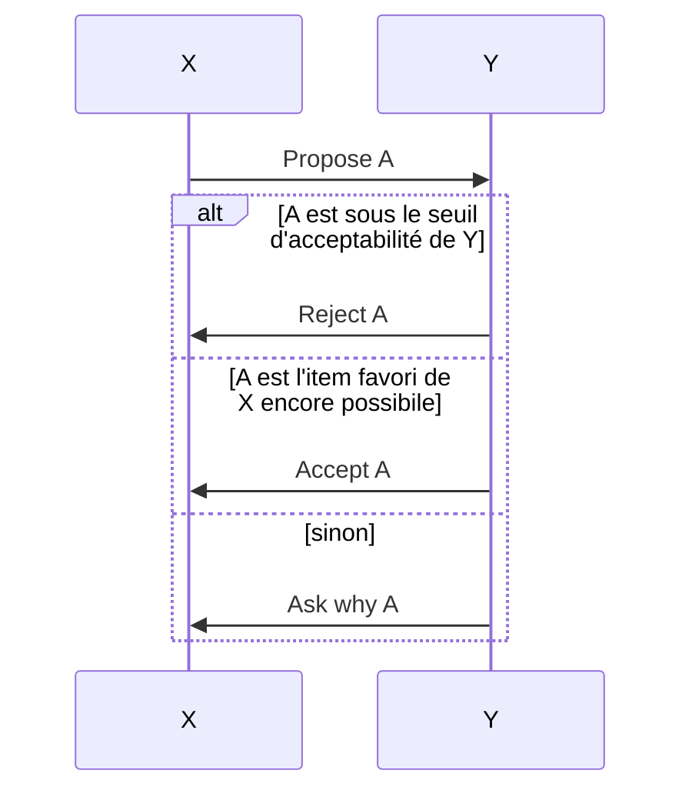
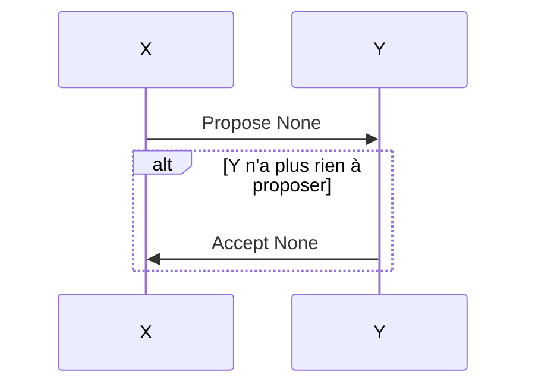
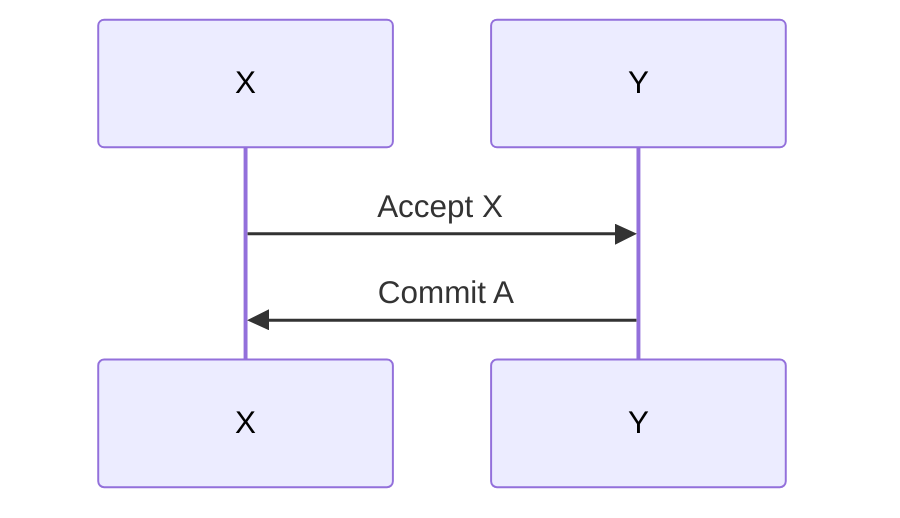
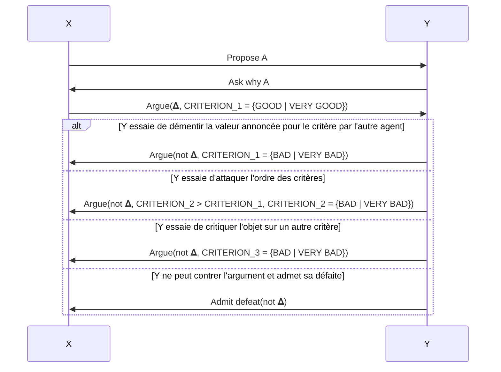

# Dialogue d'argumentation pour le choix d'un moteur de voiture

Ce projet, implémenté pour le cours de SMA, met en place un système multi-agent d'argumentation pour se mettre d'accord sur le choix d'une voiture. 
Le code peur être lancé à l'aide de `python pw_argumentation.py` pour générer des argumentations aléatoires. Il ne supporte couramment que 2 agents. Des tests de cas simples (un seul critère) sont également disponibles dans `tests.py`.

Nous détaillons ci-dessous le protocole implémenté ainsi que des statistiques sur les résultats.

<details>
  <summary>Exemple complet d'interaction</summary>
  
```
Agent 1:
    Criterion order : NOISE > PRODUCTION_COST > CONSUMPTION > DURABILITY > ENVIRONMENT_IMPACT
    Criterion values :
    |PRODUCTION_COST|CONSUMPTION|DURABILITY|ENVIRONMENT_IMPACT|NOISE
    D|**             |*          |****      |*                 |***   | 400.0
    C|*              |*          |**        |*                 |***   | 312.5
    B|**             |****       |***       |**                |*     | 193.75
    A|***            |*          |****      |*                 |***   | 500.0
    Item order : A>D>C>B 

Agent 2:
    Criterion order : ENVIRONMENT_IMPACT > DURABILITY > NOISE > PRODUCTION_COST > CONSUMPTION
    Criterion values :
    |PRODUCTION_COST|CONSUMPTION|DURABILITY|ENVIRONMENT_IMPACT|NOISE
    D|***            |**         |****      |*                 |****  | 343.75
    C|*              |***        |**        |**                |****  | 268.75
    B|**             |****       |**        |***               |*     | 387.5
    A|****           |****       |****      |*                 |**    | 300.0
    Item order: B>D>A>C

From 1 to 2 (PROPOSE) A
From 2 to 1 (ASK_WHY) A
From 1 to 2 (ARGUE) Argument(A, NOISE = GOOD)
From 2 to 1 (ARGUE) Argument(not A, NOISE = BAD)
From 1 to 2 (ARGUE) Argument(A, PRODUCTION_COST = GOOD)
From 2 to 1 (ARGUE) Argument(not A, ENVIRONMENT_IMPACT = VERY_BAD)
From 1 to 2 (ARGUE) Argument(A, DURABILITY > ENVIRONMENT_IMPACT, DURABILITY = VERY_GOOD)
From 2 to 1 (ADMIT_DEFEAT) Argument(A, DURABILITY > ENVIRONMENT_IMPACT, DURABILITY = VERY_GOOD)
From 2 to 1 (PROPOSE) B
From 1 to 2 (ASK_WHY) B
From 2 to 1 (ARGUE) Argument(B, ENVIRONMENT_IMPACT = GOOD)
From 1 to 2 (ARGUE) Argument(not B, ENVIRONMENT_IMPACT = BAD)
From 2 to 1 (ARGUE) Argument(B, CONSUMPTION = VERY_GOOD)
From 1 to 2 (ARGUE) Argument(not B, PRODUCTION_COST > CONSUMPTION, PRODUCTION_COST = BAD)
From 2 to 1 (ADMIT_DEFEAT) Argument(not B, PRODUCTION_COST > CONSUMPTION, PRODUCTION_COST = BAD)
From 2 to 1 (PROPOSE) D
From 1 to 2 (ASK_WHY) D
From 2 to 1 (ARGUE) Argument(D, DURABILITY = VERY_GOOD)
From 1 to 2 (ARGUE) Argument(not D, CONSUMPTION > DURABILITY, CONSUMPTION = VERY_BAD)
From 2 to 1 (ARGUE) Argument(D, PRODUCTION_COST > CONSUMPTION, PRODUCTION_COST = GOOD)
From 1 to 2 (ARGUE) Argument(not D, PRODUCTION_COST = BAD)
From 2 to 1 (ARGUE) Argument(D, NOISE > PRODUCTION_COST, NOISE = VERY_GOOD)
From 1 to 2 (ARGUE) Argument(not D, ENVIRONMENT_IMPACT = VERY_BAD)
From 2 to 1 (ADMIT_DEFEAT) Argument(not D, ENVIRONMENT_IMPACT = VERY_BAD)
From 2 to 1 (ACCEPT) A
From 1 to 2 (COMMIT) A
From 2 to 1 (COMMIT) A
```
</details>

## Protocole
Chaque agent dispose d'une liste ordonnée d'items selon ses préférences. Commençons par montrer le fonctionnement global du protocole sur un exemple, avant de le spécifier plus formellement. 

### Structure générale
On considère le cas de 4 items A,B,C,D à ordonner, et de deux agents X et Y. La liste ordonnée des préférences de X est A,B,C,D et celle de Y est C,B,D,A. Chaque agent dispose également d'un seuil d'acceptabilité, fixé à 80%. Trois exemples d'interaction sont présentés ci-dessous, en passant pour l'instant sur les mécanismes d'argumentation.

Dans cette interaction, les deux agents se mettent d'accord sur leur deuxième choix. La première option de X est jugée intolérable par Y, et X contre-argumente avec succès pour rejeter la première option de Y:



Dans cette interaction, les deux agents se mettent d'accord sur l'option C. La première option de X est jugée intolérable par Y, et Y parvient à convaincre X de rejeter sa deuxième option en argumentant:



Dans cette option, aucun accord n'est trouvé: X gagne l'argument sur B et ne descendra pas en-dessous, et Y gagne l'argument sur C et ne descendra pas plus bas non plus. Les deux agents concluent qu'ils n'ont pas trouvé d'accord avec deux messages `COMMIT(None)`:



Formalisons un peu les séquences présentées au-dessus dans un diagramme présentant le protocole:


* Réponses possibles au message `PROPOSE`:




* Réponse au message `COMMIT`:


Le seul cas qui reste à détailler est celui de l'argumentation.
### Argumentation


Pour contre-argumenter, un agent, dans l'ordre:
- Essaie de démentir la valeur annoncée pour le critère par l'autre agent. Il ne le fera que si cette valeur est pour lui dans {BAD, VERY BAD} et il essaie de réfuter l'argument, ou  dans {GOOD, VERY GOOD} s'il essaie de supporter l'item.

- Essaie d'attaquer l'ordre des critères. Il le fera ssi il a un critère plus important que le critère annoncé, à condition que ce critère aie la bonne valence (BAD/VERY BAD s'il attaque et GOOD/VERY GOOD sinon). Par ailleurs, il ne devra jamais avoir fait d'arguments sur ce critère de cet item au préalable, pour éviter les répétitions.

- Essaie de critiquer l'objet sur un autre critère, en soulignant que sa valeur est (GOOD, VERY GOOD) s'il argumente en faveur de l'objet, (BAD, VERY BAD) s'il argumente en défaveur de l'objet.

- Sinon, admet sa défaite.




## Statistiques 

Nous avons voulu voir si nos différents objets avaient tous la même chance d'être selectionnés à l'issu d'un compromis, ainsi que le nombre de fois ou l'on arrivait à un accord plutôt qu'à un désaccord. 


On constate que dans 40% des cas, l'objet B est selectionné, à l'inverse, l'objet C n'est quasiment jamais selectionné. Nous avons donc un grand déséquilibre dans l'appréciation de nos objets. Par ailleurs, dans 15% des cas les agents n'arrivent pas à se mettre d'accord et commit sur None. On estime qu'il s'agit d'un pourcentage raisonnable de désaccord.

Nous nous intéressons maintenant à l'appréciation que les agents ont des objets qu'ils ont accepté d'acheter après argumentation.


On constate tout d'abord que la situation est assez différente pour l'Agent 1 et pour l'Agent 2. En effet, l'Agent 2 obtient son premier voeu dans 80% des cas contre 50% des cas pour l'Agent 1. Ce deséquilibre s'explique par l'assymétrie causée par l'utilisation du BaseScheduler de mesa, qui laisse toujours les agents jouer dans le même ordre. Les rangs moyens pour les agents sont les suivants : 
```
Moyenne de l'agent 1 : 1.8908748824082784
Moyenne de l'agent 2 : 1.3080903104421449
```
Ci-dessous, la matrice de confusion affichant le rang respectif de l'Agent 1 et 2. On constate toujours que l'Agent 2 est bien avantagé.


