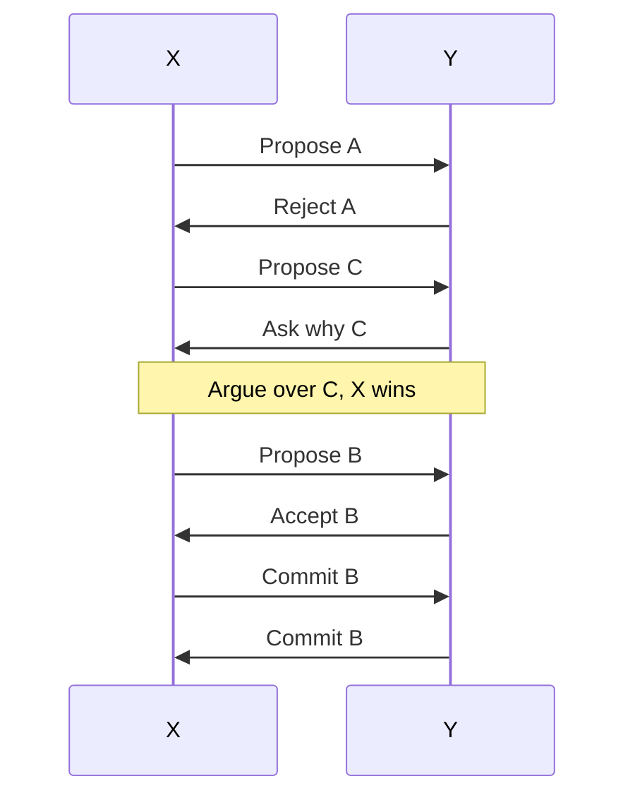

# Dialogue d'argumentation pour le choix d'une voiture

## Protocole
Chaque agent dispose d'une liste ordonnée d'items selon ses préférences.

```mermaid
sequenceDiagram
    X->>Y: Propose A
    Y->>X: Reject A
    X ->>Y: Propose C
    Y ->> X: Ask why C
    Note over X,Y: Argue over C, X wins
    X ->> Y: Propose B
    Y ->> X: Accept B
    X ->> Y: Commit B
    Y ->> X: Commit B
```